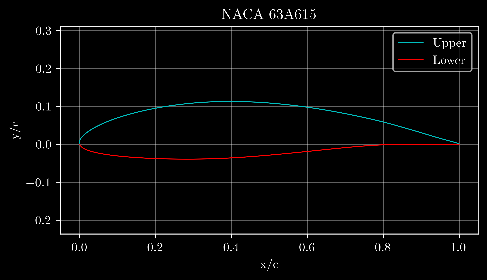
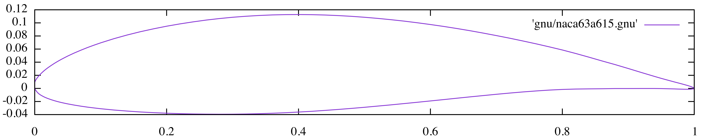

# NACA456 Airfoil Generation Program
Python wrapper for the NACA456 airfoil generation program.



This program is made available by [Public Domain Aeronautical Software (PDAS)](https://www.pdas.com/naca456.html), and is managed by Ralph Carmichael.  The source files were downloaded from PDAS on April 25th, 2025.

To compile **naca456** use:
```bash
gfortran naca456.f90 -o naca456
```
This will create a binary executable file called **naca456**.

*Optional: once you have compiled the program, you may wish to create a symbolic link so that you can call it from any directory.<br>
To do this, enter the following command (be sure the path points to wherever your executable binaries are stored):*
```bash
ln -s naca456 /usr/local/bin/naca456
```


To run the program, specify the input file as a command line argument:
```bash
naca456 samples/63A415.nml
```


You can also run the program without arguments, and specify the input file interactively.

The program will produce 3 output files: 
1. Debug file (*.dbg)
2. Output file (*.out)
3. Plotting file (*.gnu)

You can plot the airfoil shape using ```gnuplot``` (available via Macports):
```bash
gnuplot
set size ratio -1
plot 'naca.gnu' with lines 
```



By default, gnuplot will expand the vertical scale to fit the screen; this is objectively annoying.<br>
To plot the airfoil using normal proportions, you must use the ```set size ratio -1``` command.

This repository contains a Python script (src/run_naca456) that facilitates airfoil generation by automating the following steps:
1. Create an input file based on user-specified airfoil parameters.
2. Run **naca456**.
3. Read the **naca456** output files.
4. Plot the airfoil profile.
5. Export a .dat file formatted for XFOIL.
